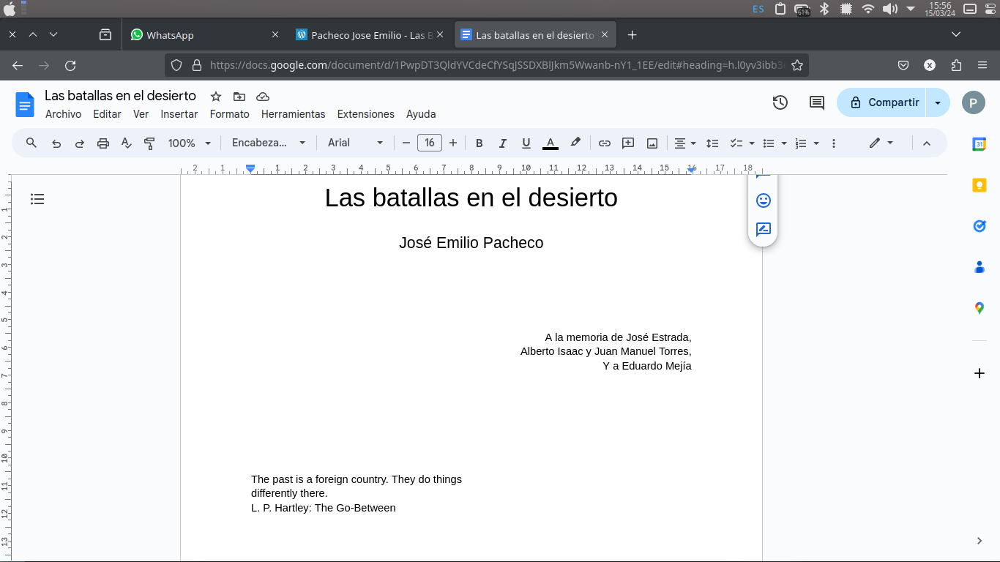
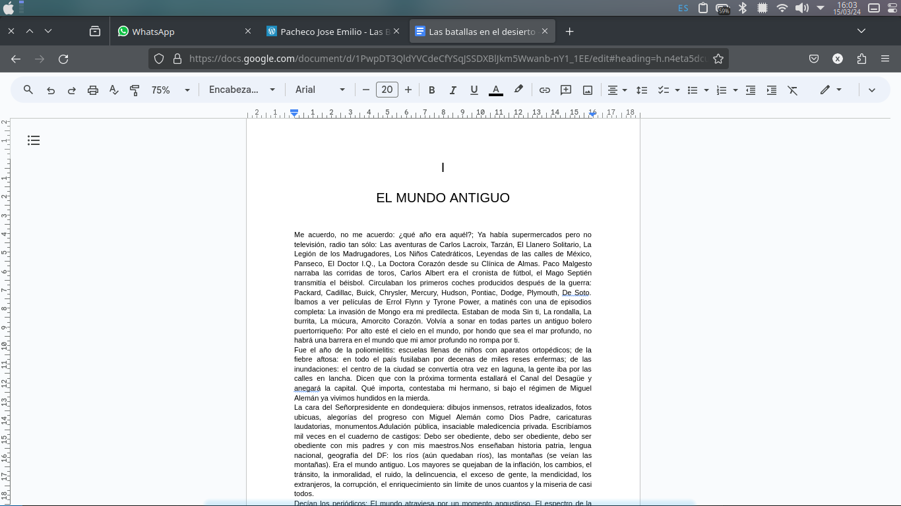

<h1>Documentos de texto</h1>

Podemos encontrar a lo largo de nuestro trabajo la necesidad de crear o editar documentos de texto asi como si fueran una carta, estos documentos pueden ser informes, cartas, curriculums vitae, libros, etc.
Para ello ciertas empresas han creado distintos programas para ayudarnos en la tarea, entre estos programas podemos encontrar "Word" que depende de el paquete Office, "Docs" que depende de Google, estos son los programas mas reconocidos en la edicion de texto, existen muchas mas paqueterias de programas de oficina pero la mayoria funciona de una forma similar.

Al igual que en una documento escrito a mano podemos encontrar distintos elementos y es una buena practica que aprendamos a utilizarlos para dar una buena imagen a nuestro trabajo. Los elementos con que podemos realizar un documento son: Titulos, Subtitulos, Parrafos, Listas, Graficos, Imagenes, Indices, Encabezado de pagina, Pies de pagina y una gran variedad mas de elementos que podemos agregar para poder cumplir con nuestro fin.

En la imagen anterior podemos un documento de texto, me gustaria que antes de seguir me describas que es los elemtos de texto que puedes apreciar en un documentos nuevo de texto y mientras vamos avanzando en la actividad complementes ese documento con las actividades asignadas.
Recuerda que para crear un documento nuevo usaremos un navegador y en la barra de navegacion escriviremos "docs.new".

En la imagen anterior ¿Que elementos podemos observar? anexa tu respuesta en el documento.
Atraves del siguiente link encontraras el documento, transcribelo respetando saltos de linea, recuerda que el salto de linea se realiza con el boton enter del teclado
https://docs.google.com/document/d/1PwpDT3QldYVCdeCfYSqJSSDXBlJkm5Wwanb-nY1_1EE/edit?usp=sharing

